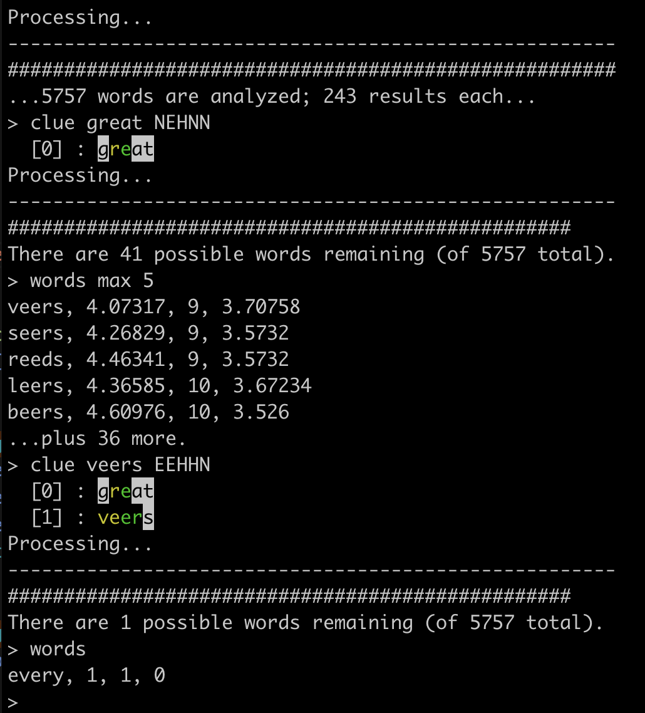

# WordlePlay
Analysis tools for Wordle puzzles

Wordle-CommandLine provides a terminal-style interface to analyze Wordle puzzles.
You can include clues (guesses and results) and then collect information about
word frequency.

Printing words provides data on the word itself, the average number of words that
will be narrowed-down-to if you use it as the next guess, the maximum number of 
words left (in the worst case), and the amount of information that word would
provide on the final answer.

## Example usage:

## Installation

The main requirement is a newer version of gcc or clang capable of running C++ 20.

After downloading the code, you shoud be able to type 'make' to compile the
command-line version of the software into an executable called 'Wordle-CommandLine'.
